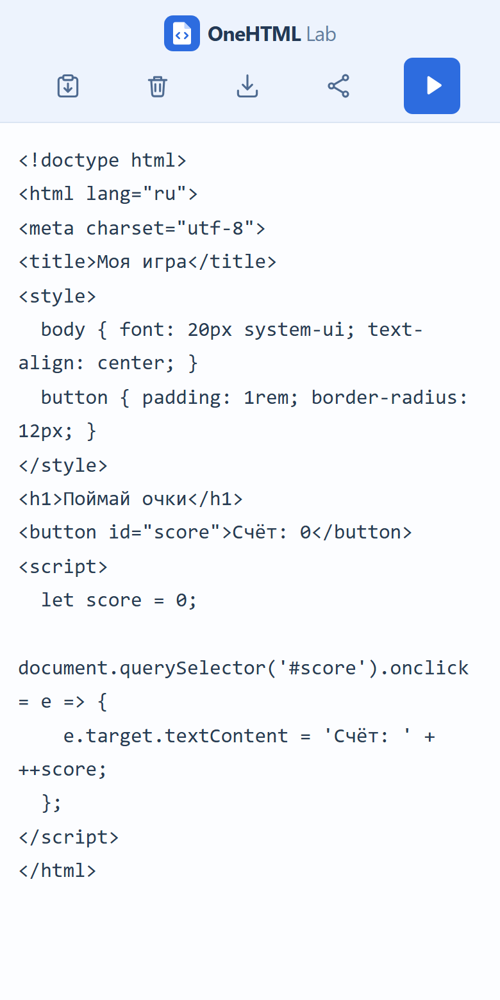

# OneHTML Lab

OneHTML Lab — простой редактор для одной HTML-игры. Вставьте код на телефоне или компьютере, проверьте игру прямо в приложении и сохраните готовый `game.html`. Для работы самого редактора установка и сервер не нужны.

**[Открыть приложение](https://ilyabarilo.github.io/onehtml-lab/)** · **[Скачать готовый HTML](https://github.com/IlyaBarilo/onehtml-lab/releases/latest)**

Простой режим: вставка, очистка, запуск и остановка, сохранение и отправка файла. В обоих режимах работают сеть игры, виртуальный `localStorage` для игровых рекордов, автоматическая подмена доступных библиотек в предпросмотре, выбор встраивания библиотек при сохранении, показ ошибок запущенного кода и один автоматически сохраняемый черновик. Экспертный режим добавляет открытие HTML-файла, переключатель игрового хранилища, историю 20 прошлых версий, сравнение текущего кода с любой записью истории, возврат из истории, вынос встроенных библиотек в CDN-ссылки или файлы рядом для анализа кода в ИИ, состояние сохранения, ссылки на ИИ-ботов и готовые запросы, шесть полноэкранных готовых игр, две исходные игры ИИ с ошибками для самостоятельного исправления и тест работы библиотек с FPS, касаниями, нагрузкой до 10000 объектов и демонстрациями возможностей движков. Для готовых примеров есть вкладки «Телефон» и «Компьютер». Выбранный режим и настройки сети и игрового хранилища восстанавливаются при следующем открытии. [Руководство](docs/USAGE.md) · [Сборка из исходников](docs/DEVELOPMENT.md) · [Вопросы и идеи](https://github.com/IlyaBarilo/onehtml-lab/discussions) · [Лицензия MIT](LICENSE)

Код, документация, значки, включая логотип, и изображения проекта распространяются по [лицензии MIT](LICENSE). Загружаемые библиотеки имеют собственные лицензии MIT; полный текст лицензии включается в игры, сохранённые вместе с библиотеками.



## Быстрый старт

1. Откройте приложение по ссылке выше или скачайте `onehtml-lab.html` из последнего выпуска и откройте файл в браузере.
2. Вставьте свой HTML-код в большое поле. Кнопка вставки заменяет код целиком; обычная команда «Вставить» в поле действует в позиции курсора.
3. Нажмите «Запустить» — поле сменится игрой. «Стоп» вернёт исходный код. Нажмите «Сохранить» и подтвердите предложенное имя `game.html` либо измените его.

Для проверки можно вставить этот пример. После запуска кнопка в игре должна увеличивать счёт:

```html
<!doctype html>
<html lang="ru">
<meta charset="utf-8">
<button id="score">Счёт: 0</button>
<script>
  let score = 0;
  document.querySelector('#score').onclick = event => {
    event.target.textContent = `Счёт: ${++score}`;
  };
</script>
</html>
```

Предпросмотр изолирован от редактора, но игре разрешены внешние HTTPS-ресурсы, если доступ включён. Библиотеки игр в комплект редактора не входят. Для поддерживаемых версий Three.js r128–r160, Matter.js и Phaser 3 приложение предлагает скачать код и лицензию, затем хранит их в IndexedDB. Распознаются ссылки на CDN и локальные пути с версией в имени или каталоге, включая подкаталоги и `../`. Для других локальных JS-подключений можно выбрать файл библиотеки и её MIT-лицензию. Уже подготовленные библиотеки используются без повторного скачивания, в том числе при отключённой сети игры. Доступные библиотеки автоматически используются в предпросмотре и отправляемой копии. При сохранении можно получить один HTML со встроенными библиотеками, HTML и отдельные JS-файлы для сохранения в одну папку или исходный код с внешними ссылками. Лицензии включаются в подготовленные библиотеки. Код в поле не меняется. Неподдерживаемые сетевые адреса, ES-модули и подключения с `async`, `defer` или `nomodule` не подменяются. При обнаружении загрузки приложение показывает число замеченных файлов и измеренный объём в КБ. Если размер не измерен, отображается «(нет данных)». Фактический трафик может быть больше. Отдельно открытый сохранённый файл работает вне защитного окна редактора. Черновик сохраняется в браузере в обоих режимах, если доступно локальное хранилище; для отдельной копии сохраните HTML-файл. Отправка файла через системное меню зависит от поддержки браузера.

Автор: [Илья Барило](https://barilo.ru/).
